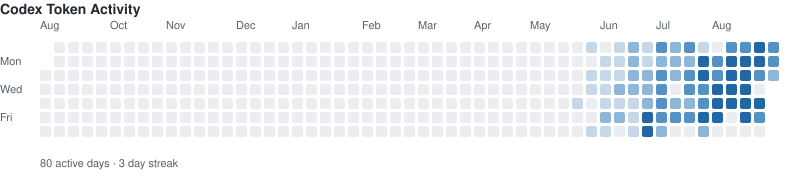

# Hi，Welcome to Kari's area🥳

大三供应链管理专业学生、AI 产品学习者、AI爱好者与内容创作者。

我正在通过真实的小项目学习AI产品，把重复工作与具体的需求沉淀成可复用的 Agent、Skill、自动化工作流和内容资产。

## Currently exploring 

- AI 产品设计与需求验证
- Agent、Skill 与工作流自动化
- AI 辅助内容创作和知识库建设
- 从想法到可交付产品的轻量化开发

## Building principles

```text
Start from a real problem
Keep human judgment in the loop
Automate repeated work
Turn lessons into reusable assets
```

## Current projects
https://gtm-content-growth-workbench.vercel.app/](https://github.com/1736280642-Star/Greenlens/tree/main)
https://github.com/1736280642-Star/Goal-driven-AI-Knowledge-OS-

## 🤖 Codex Activity



## Connecting with me 📬
email: 1736280642@qq.com
